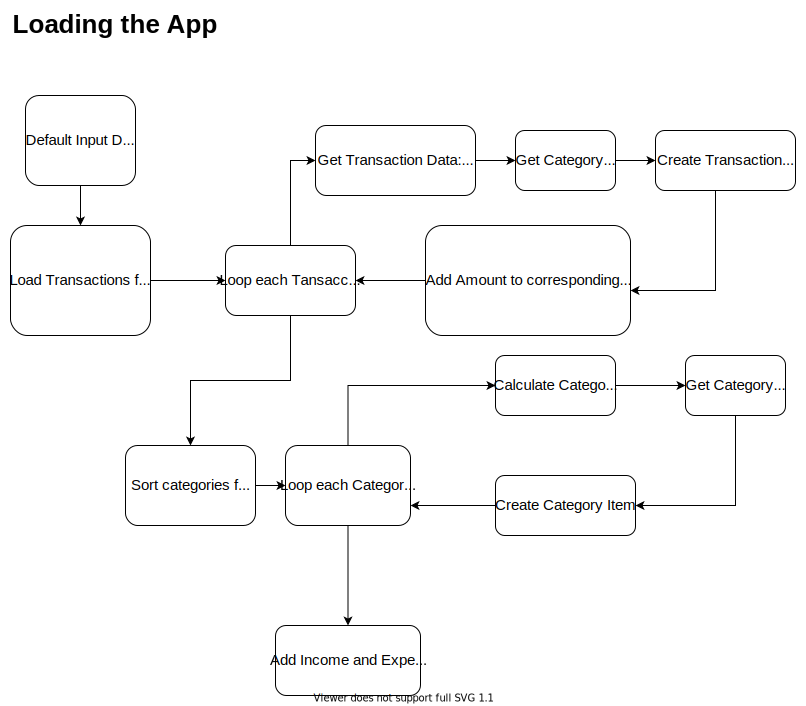
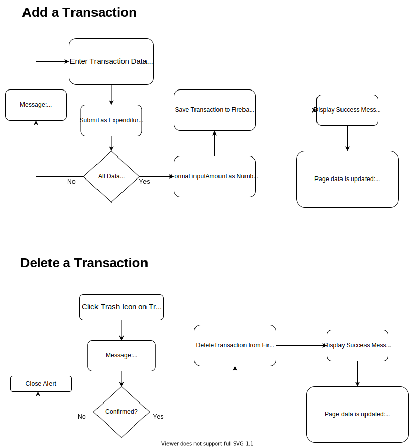

  

# Web App

* SaveMyMoney is a web application created to help users to track monthly transactions such as expenses and incomes. 
* This application was created using HTML, CSS, JavaScript (Vanilla) and Firebase.

  

## Demo

  

Here you can find the app demo: https://savemymoney.vercel.app/

  

## Built with

* HTML
* CSS
* JavaScript (Vanilla)
* Firebase

## How does it work?

## Coach 

Ana Belisa Martínez

## Made with ❤️ By:

[Denisse Rivas](https://github.com/iqrivas) | 
Slack: [David Galeano [C7] ](https://github.com/davidevOS) |  Frontend

